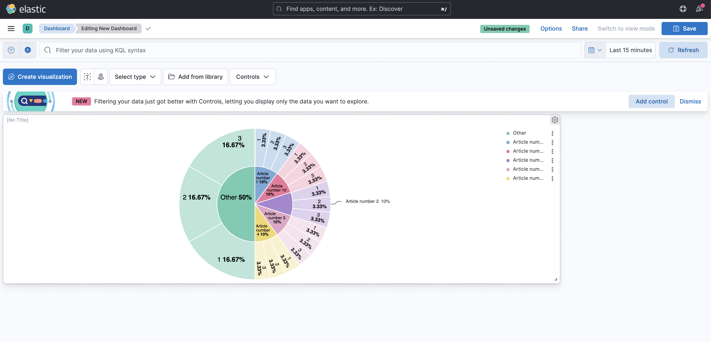
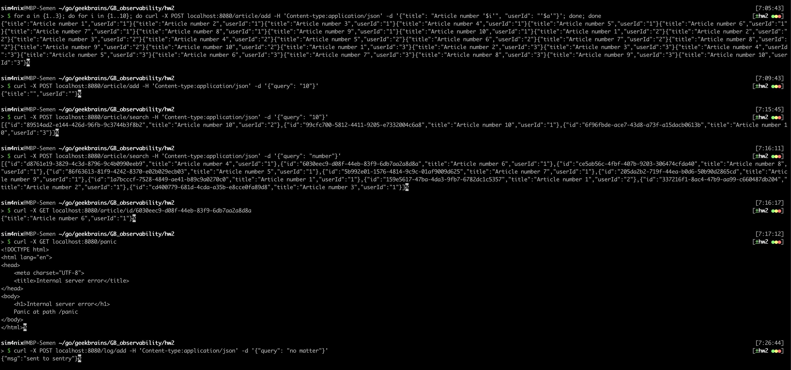

# ДЗ 02
## п. 1 Взять за основу репозиторий https://github.com/modeckrus/elastic и переписать с учетом коментариев 

Репозиторий склонирован, исправлены пути импорта, внесены изменения в конфиги
для полноценного запуска Elastic Stack + Kibana.  
Создан Dockerfile для запуска приложения в отдельном контейнере.  
Вместо `martini` используется `gin`.
Информация из ElasticSearch корректно отображается в Kibana.

## п. 2 Прикрепить скриншоты запросов
Запросы тестировались с помощью стандартной утилиты curl.  

## п. 3 Прикрепить скриншоты из Sentry
Логи в Sentry отправляются успешно.

Реализована отправка ошибок (path `/panic`).

А также отправка обычных сообщений (path `/log/add`)
